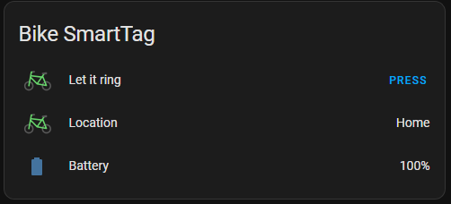

# SmartThings Find Integration for Home Assistant

This integration adds support for devices from Samsung SmartThings Find. While intended mainly for Samsung SmartTags, it also works with other devices, such as phones, tablets, watches and earbuds.

Currently the integration creates three entities for each device:
* `device_tracker`: Shows the location of the tag/device.
* `sensor`: Represents the battery level of the tag/device (not supported for earbuds!)
* `button`: Allows you to ring the tag/device.



This integration does **not** allow you to perform actions based on button presses on the SmartTag! There are other ways to do that.


## ⚠️ Warning/Disclaimer ⚠️

- **Work in Progress**: This integration is still under development, and features may change without notice.
- **API Limitations**: Created by reverse engineering the SmartThings Find API, this integration might stop working at any time if changes occur on the SmartThings side.
- **Limited Testing**: The integration hasn't been thoroughly tested. If you encounter issues, please report them by creating an issue.
- **Feature Constraints**: The integration can only support features available on the [SmartThings Find website](https://smartthingsfind.samsung.com/). For instance, stopping a SmartTag from ringing is not possible due to API limitations (while other devices do support this; not yet implemented)

## Notes on authentication
The integration simulates Samsung login using QR code. It stores the retrieved JSESSIONID-Cookie and uses it for further requests. **It is not yet known, how long the session is valid!** While it did work for at least a few days for me, there's no definite answer and the session might become invalid anytime! As a precaution I implemented a reauth-flow: In case the session expires, Home Assistant will inform you and you have to repeat the QR code login process.

## Notes on connection to the devices
Being able to let a SmartTag ring depends on a phone/tablet nearby which forwards your request via Bluetooth. If your phone is not near your tag, you can't ring it. The location should still update if any Galaxy device is nearby. 

If ringing your tag does not work, first try to let it ring from the [SmartThings Find website](https://smartthingsfind.samsung.com/). If it does not work from there, it can not work from Home Assistant too! Note that letting it ring with the SmartThings Mobile App is not the same as the website. Just because it does work in the App, does not mean it works on the web. So always use the web version to do your tests.

## Installation Instructions

1. Download the `custom_components/smartthings_find` directory to your Home Assistant configuration directory.
2. Restart Home Assistant.

Note: HACS support is coming soon!

## Setup Instructions

[](https://my.home-assistant.io/redirect/config_flow_start/?domain=smartthings_find)

1. Go to the Integrations page
2. Search for "SmartThings *Find*" (**do not confuse with the built-in SmartThings integration!**)
3. To login, scan the QR Code shown in the config flow or follow the shown link.
4. Wait a few seconds, and the integration should be ready.

## Debugging

To enable debugging, you need to set the log level in `configuration.yaml`:

```yaml
logger:
  default: info
  logs:
    custom_components.smartthings_find: debug
```

## License

This project is licensed under the MIT License. See the [LICENSE](LICENSE) file for details.

## Contributions

Contributions are welcome! Feel free to open issues or submit pull requests to help improve this integration.

## Support

For support, please create an issue on the GitHub repository.

## Roadmap

- HACS support
- Service to let a device ring
- Service to make a device stop ringing (for devices that support this feature)
- Allow adding two instances of this integration (two Samsung Accounts)

## Disclaimer

This is a third-party integration and is not affiliated with or endorsed by Samsung or SmartThings.
